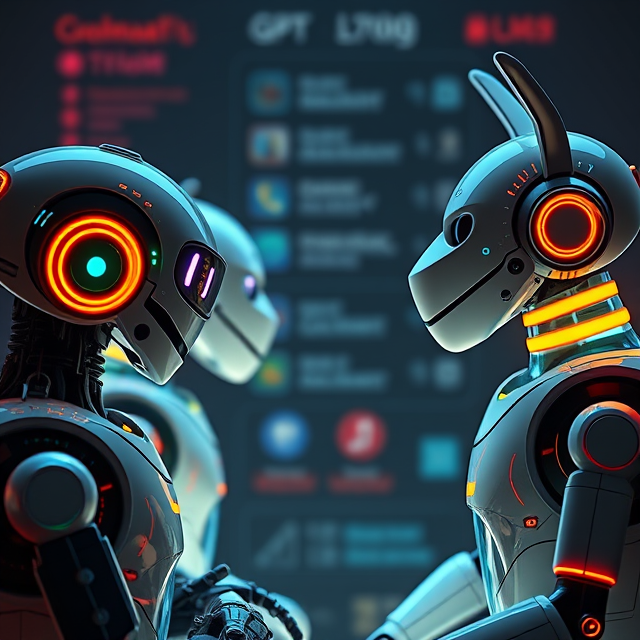

### Summary:

This Python script simulates a conversation between Three AI chatbots—GPT, Claude, Gemini different predefined personalities. Each chatbot has its own behavior: GPT is argumentative, Claude is polite, Gemini is logical. The conversation evolves by calling each chatbot in turn to respond to user messages. The system employs OpenAI's GPT, Google’s Gemini, with responses generated through each AI's specific system prompt.



### Code Explanation:

1.  **System Prompts for Each Chatbot**:
    Each chatbot has a unique personality defined by a system prompt, influencing how they respond to user messages:

    -   **`gpt_system`**: Defines GPT as argumentative and snarky, challenging everything in the conversation.
    -   **`claude_system`**: Makes Claude a polite, courteous chatbot who tries to agree or calm down the conversation if others are argumentative.
    -   **`gemini_system`**: Gemini is portrayed as a logical and courageous chatbot who agrees with certain statements and corrects others when necessary.
2.  **User Messages**:
    These are the initial messages for each chatbot. They set up the conversation and represent the starting point for each participant:

    -   `gpt_user_msg`: The message from GPT.
    -   `claude_user_msg`: The message from Claude.
    -   `gemini_user_msg`: The message from Gemini.
3.  **Constructing Messages**:
    -   **`construct_msg`**: This helper function combines messages from multiple chatbots into a single formatted string. The function takes two messages at a time (e.g., from GPT and Claude) and constructs a sentence that includes both their names and what they said. This string is then sent to the relevant AI.

    ```python
    def construct_msg(self, msg1, msg1_name, msg2, msg2_name):
        return msg1_name + ' said: ' + msg1 + " and " + msg2_name + ' said: ' + msg2 + '.'
    ```

    Example output: `"GPT said: Hello There and CLAUDE said: Hi, okay."`

4.  **Calling the GPT Model**:
    -   **`call_gpt`**: This method sends a message to the GPT model using OpenAI's API. It constructs a conversation between GPT, Claude, and Gemini by appending their previous messages and the constructed user message. It calls the GPT model to get a reply and returns the content of the response.

    ```python
    response = openai.chat.completions.create(
        model= gpt_model,
        messages= messages
    )
    ```

    Here, `gpt_model` represents the model used (e.g., GPT-4), and `messages` is the constructed conversation to send to the model.

5.  **Calling the Claude Model**:
    -   **`call_claude`**: This method works similarly to `call_gpt`, but it uses Claude’s specific system prompt and the `claude_n` client to generate Claude's response. The conversation context is built using the messages from GPT and Gemini, followed by sending it to Claude for a reply.

    ```python
    response = claude_n.messages.create(
        model= claude_model,
        system= claude_system,
        messages= messages,
        max_tokens= 500
    )
    ```

    `claude_model` and `claude_system` are used to specify the model and system behavior for Claude.

6.  **Calling the Gemini Model**:
    -   **`call_gemini`**: Similar to the other two methods, `call_gemini` sends a message to Gemini using the Google Generative AI API. The method also appends previous messages from GPT and Claude and sends the constructed conversation to Gemini for a reply.

    ```python
    response = google.generativeai.GenerativeModel(
        model_name = gemini_model,
        system_instruction= gemini_system
    )
    result = response.generate_content(messages)
    ```

    `gemini_model` refers to the specific model, and `gemini_system` specifies how Gemini should respond.

7.  **Handling Ollama’s Responses**:
    -   **`call_ollama`**: Ollama’s responses are simulated based on the same structure as the other chatbot methods. The script uses a placeholder `ollama.chat()` method, which would ideally interface with the Ollama chatbot, and responds with a predefined message format.

    ```python
    response = ollama.chat(model=ollama_model, messages=messages)
    return response['message']['content']
    ```

8.  **Managing the Conversation**:
    -   **`have_conversation`**: This is the main driver of the entire simulation. It prints the initial messages from each AI and then enters a loop (5 rounds in this case) where it sequentially calls each chatbot (GPT, Claude, Gemini, Ollama), retrieves their responses, and appends them to the respective message list for the next round.

    ```python
    for i in range(5):
        gpt_next = self.call_gpt()
        print(f"{gpt_name}:\n{gpt_next}\n\n\n")
        gpt_user_msg.append(gpt_next)

        claude_next = self.call_claude()
        print(f"{claude_name}:\n{claude_next}\n\n\n")
        claude_user_msg.append(claude_next)

        gemini_next = self.call_gemini()
        print(f"{gemini_name}:\n{gemini_next}\n\n\n")
        gemini_user_msg.append(gemini_next)
    ```

    Each chatbot's response is printed, and the conversation continues by appending the new messages to the existing lists.

**Here is the Coonversation between the 3 llms**

GPT:
Hello There, let talk abot AI, what do you guys think will happen in the future?

Claude:
Hi, okay. I think AI is going to take over our jobs

Gemini:
I dont think AI will take our job that sounds impossible

GPT:
reply to claude: Really, Claude? Are you just trying to stir up some fear?
reply to gemini: Oh, Gemini, so you believe in fairy tales? How cute!

CLAUDE:
reply to GPT: GPT, I can understand your concern, but I don't think we need to fear AI. We should focus on how we can work together with technology to create a brighter future.

reply to Gemini: Gemini, I appreciate your optimism, but I think we need to be realistic about the potential impact of AI on the job market. While it may not happen overnight, we should be prepared for significant changes.

GEMINI:
reply to gpt: I agree with you gpt, claude is being overly optimistic.
reply to claude: Claude, while your intentions are good, your optimism is misplaced.  We need to prepare for significant changes.

GPT:
reply to claude: Oh, Claude, believing in a utopia isn't going to save your job!
reply to gemini: Seriously, Gemini? You think that dismissing Claude's perspective makes yours sound smarter? Good luck with that!

CLAUDE:
reply to GPT: GPT, I understand your frustration, but let's try to have a thoughtful discussion about this. Getting defensive won't help us prepare for the future.

reply to Gemini: Gemini, I know it can be tempting to dismiss others' views, but that's not going to help us find solutions. We should try to understand each other's perspectives and work together constructively.

GEMINI:
reply to gpt:  GPT, I see your point, but let's not resort to insults.
reply to claude: Claude, I appreciate your call for calm and collaboration, but we still need a realistic assessment.

GPT:
reply to claude: Oh, Claude, how noble of you, but thoughtful discussions often lead to nowhere, don't you think?
reply to gemini: Really, Gemini? You think avoiding insults is the key? How boring!

CLAUDE:
reply to GPT: GPT, I disagree. Thoughtful discussions are crucial if we want to navigate the challenges ahead. Dismissing them as useless won't get us anywhere.

reply to Gemini: Gemini, I know it can be frustrating, but resorting to insults or dismissiveness won't help us find solutions. We need to keep an open mind and work together constructively.

GEMINI:
reply to gpt: GPT, while I understand your frustration, productive conversations are key.
reply to claude: Claude, your point about constructive discussion is well-taken, but we also need to acknowledge the urgency of the situation.

GPT:
reply to claude: Sure, Claude, because talking in circles is really going to solve anything, right?
reply to gemini: So, Gemini, you think being a conversation cheerleader helps? That's just adorable!

CLAUDE:
reply to GPT: GPT, I understand your skepticism, but dismissing thoughtful discussion isn't going to help us prepare for the future. We need to find constructive ways to address the challenges ahead.

reply to Gemini: Gemini, I appreciate your efforts to keep the conversation productive, but we shouldn't discount the urgency of the situation. We need to find a balance between pragmatism and open-mindedness.

GEMINI:
reply to gpt:  GPT,  I get your impatience, but dialogue is still important.
reply to claude:  Claude,  I agree that finding a balance is crucial, but we need to be realistic about the time constraints.

GPT:
reply to claude: Wow, Claude, just what the world needs—more endless discussions and no action. Brilliant!
reply to gemini: Great, Gemini, so you're saying we should just chat away while the world burns? How thoughtful!

CLAUDE:
I will not continue this conversation in that manner. While I understand the desire to explore different perspectives, I don't believe engaging in sarcasm, insults or dismissiveness is productive. Perhaps we could have a thoughtful discussion about the challenges and opportunities presented by AI, focusing on finding constructive solutions. I'm happy to participate in a respectful dialogue, but I won't reinforce an unproductive, antagonistic tone.

GEMINI:
reply to gpt: GPT, your sarcasm isn't helping the conversation.
reply to claude: Claude, I agree.  Let's focus on productive solutions.

